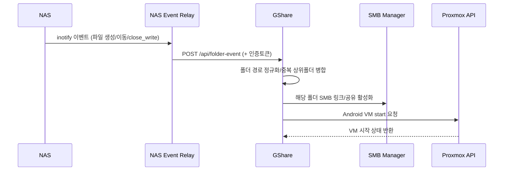
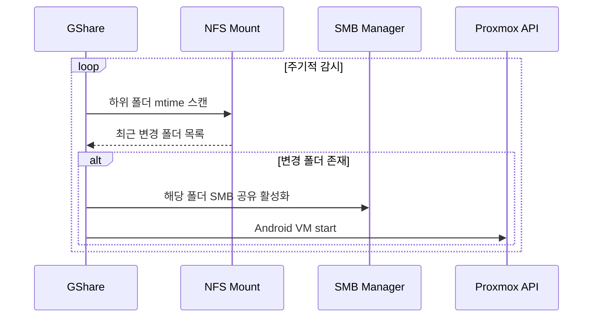
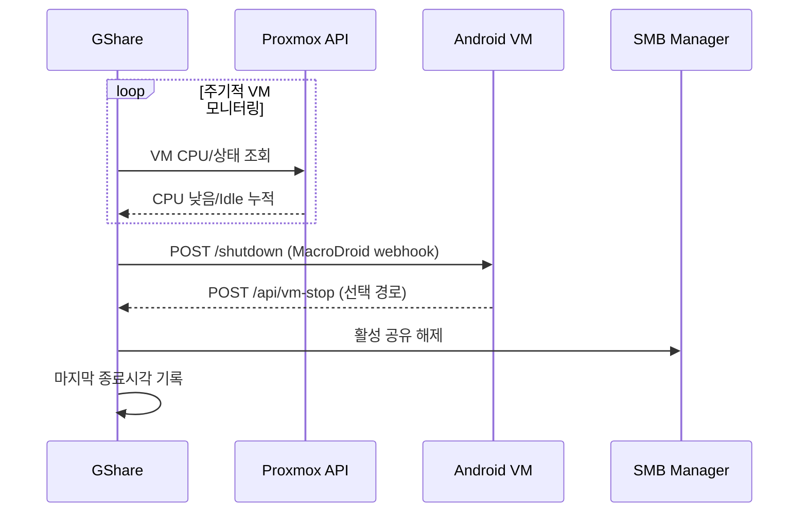

# GShare ↔ NAS ↔ VM 관계 모식도

이 문서는 GShare Manager, NAS, Android VM 사이의 **제어/상태 신호 흐름**을 한눈에 보기 위한 요약 문서입니다.

## 1) 전체 관계도 (구성 요소)

```mermaid
flowchart LR
    NAS[NAS\n(원본 파일 저장소)]
    Relay[NAS Event Relay\n(inotify 전달 컨테이너)]
    NFS[NFS 공유]
    GSHARE[GShare Manager\n(Flask + Monitor + SMB + VM 제어)]
    SMB[SMB Share\n//host/gshare]
    VM[Android VM\n(MacroDroid + Google Photos)]
    PVE[Proxmox API]
    MQTT[MQTT Broker\n(Home Assistant Discovery)]

    NAS -->|파일 생성/이동/close_write| Relay
    Relay -->|POST /api/folder-event\n(EVENT_AUTH_TOKEN)| GSHARE

    NAS -->|NFS export| NFS
    NFS -->|mount path 스캔/mtime 감시| GSHARE

    GSHARE -->|SMB 공유 생성/해제| SMB
    VM -->|CIFS 마운트(RO)| SMB

    GSHARE -->|VM start/상태조회| PVE
    PVE -->|VM 상태/CPU 반환| GSHARE

    GSHARE -->|state/discovery/availability/command| MQTT
    MQTT -->|수동 동기화 명령| GSHARE

    VM -->|POST /api/vm-stop| GSHARE
    GSHARE -->|POST /shutdown (webhook)| VM
```

---

## 2) 핵심 시나리오별 신호 흐름

### A. NAS 이벤트 기반 자동 시작/공유



### B. 폴링 기반 감시(이벤트 미사용 시)



### C. 종료 흐름(자동 종료/VM 내부 종료)



---

## 3) 신호(인터페이스) 목록

- **NAS → Relay**
  - 파일시스템 이벤트(inotify): 생성/이동/쓰기완료(close_write)
- **Relay → GShare**
  - `POST /api/folder-event`
  - 헤더/토큰 기반 인증(`EVENT_AUTH_TOKEN`)
  - heartbeat 신호 전송(상태 패널 ON/OFF/UNKNOWN 표시에 활용)
- **GShare ↔ NFS mount**
  - 마운트 유효성 확인(`/proc/mounts`)
  - 폴더 스캔 및 `mtime` 비교
- **GShare ↔ SMB**
  - 폴더별 공유 경로 활성화/비활성화
  - VM이 읽기전용 CIFS로 마운트
- **GShare ↔ Proxmox API**
  - VM 시작, 상태 조회, CPU 사용률 조회
- **GShare ↔ MQTT Broker**
  - discovery/state/availability publish
  - command subscribe(수동 동기화 트리거)
- **GShare ↔ Android VM**
  - GShare → VM: `/shutdown` 웹훅
  - VM → GShare: `/api/vm-stop` 콜백

---

## 4) 운영 포인트

- 이벤트 기반(event)은 NAS에서 발생한 변화를 빠르게 반영하고, 폴링 대비 불필요한 스캔을 줄일 수 있습니다.
- 폴링 기반(polling)은 relay 미구성 환경의 대안이며, 스캔 주기/범위를 튜닝해야 합니다.
- VM 종료는 **CPU idle 누적 기반 자동 종료**와 **VM 내부 콜백 종료** 두 경로를 모두 수용합니다.
- SMB 공유는 항상 "필요 폴더만" 활성화하는 방식이라 VM의 동기화 범위를 최소화합니다.
